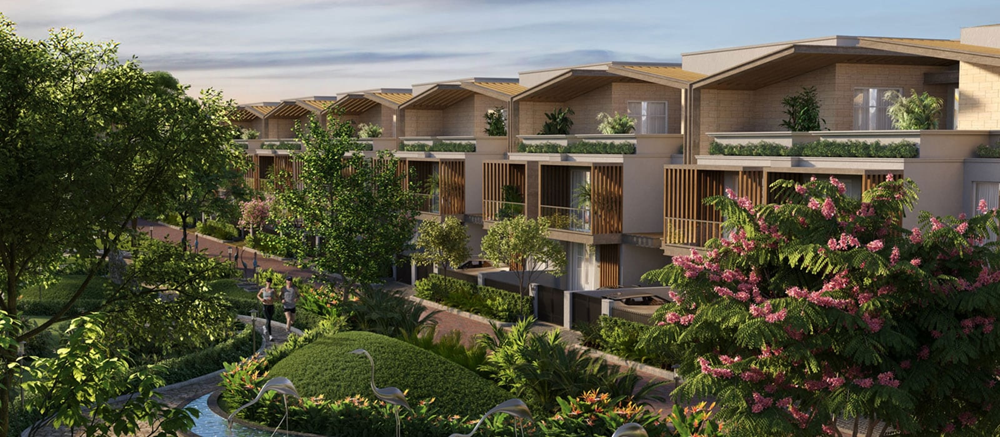

# MUREC Real Estate - Cinematic Animation Website

A premium real estate website featuring cinematic animations and interactions inspired by modern luxury brands. Built with Next.js 14, TypeScript, GSAP, and Three.js.



## 🌟 Features

### 🎬 Cinematic Animations
- **Smooth Scroll Experience**: Powered by Lenis for buttery smooth scrolling
- **GSAP + ScrollTrigger**: Professional-grade animations tied to scroll position
- **Text Reveal Animations**: Word-by-word and line-by-line text animations
- **Image Reveal Effects**: Mask-based image reveals with parallax effects
- **3D Depth Effects**: Subtle Three.js architectural elements for premium feel

### 🏡 Real Estate Focused Features
- **Properties Carousel**: Cinematic full-screen property showcase with auto-play
- **Interactive Floor Plans**: SVG-based floor plans with hover and click interactions  
- **Property Cards**: Animated cards with magnetic hover effects
- **Stats Counters**: Animated number counting with scroll trigger
- **Architectural Depth**: 3D geometric elements using React Three Fiber

### 📱 Responsive & Accessible
- **Mobile-First Design**: Fully responsive across all device sizes
- **Touch Optimizations**: Enhanced interactions for mobile and tablet
- **Accessibility Features**: WCAG 2.1 AA compliance with keyboard navigation
- **Performance Optimized**: Lazy loading, optimized images, and efficient animations
- **Reduced Motion Support**: Respects user's motion preferences

### 🎨 Modern UI/UX
- **Magnetic Button Interactions**: Buttons that follow cursor with elastic animations
- **Premium Transitions**: Smooth section-to-section transitions
- **Parallax Effects**: Multiple layers of parallax for depth
- **Dark Theme**: Elegant dark theme with gold accents
- **Typography Animations**: Kinetic typography with stagger effects

## 🛠 Tech Stack

- **Framework**: Next.js 14 with App Router
- **Language**: TypeScript
- **Animation**: GSAP with ScrollTrigger plugin
- **Smooth Scroll**: Lenis
- **3D Graphics**: Three.js with React Three Fiber
- **Motion**: Framer Motion for component animations
- **Styling**: CSS Modules with CSS Custom Properties
- **Icons**: Custom SVG icons
- **Deployment**: Vercel (recommended)

## 📦 Installation

### Prerequisites
- Node.js 18+ 
- npm or yarn package manager

### Setup Instructions

1. **Clone the repository**
   ```bash
   git clone https://github.com/Santoshpatel112/Propacity-Assignment.git
   cd propacity_assignment
   ```

2. **Install dependencies**
   ```bash
   npm install
   # or
   yarn install
   ```

3. **Run the development server**
   ```bash
   npm run dev
   # or  
   yarn dev
   ```

4. **Open your browser**
   Navigate to [http://localhost:3000](http://localhost:3000)

## 🏗 Project Structure

```
propacity_assignment/
├── app/                          # Next.js 14 App Router
│   ├── globals.css              # Global styles and animations
│   ├── layout.tsx               # Root layout with providers
│   ├── page.tsx                 # Homepage with all animations
│   ├── about/                   # About page
│   ├── blog/                    # Blog pages
│   ├── careers/                 # Careers page
│   ├── contact/                 # Contact page
│   ├── design-philosophy/       # Design philosophy page
│   ├── forest-walk/            # Forest Walk project page
│   ├── legacy/                 # Legacy page
│   ├── news/                   # News page
│   ├── principles/             # Principles page
│   └── api/                    # API routes
├── components/                  # React components
│   ├── SmoothScrollProvider.tsx # Lenis smooth scroll wrapper
│   ├── CinematicHero.tsx       # Hero section with video/image
│   ├── RealEstateShowcase.tsx  # Property cards grid
│   ├── PropertiesCarousel.tsx  # Full-screen property carousel
│   ├── InteractiveFloorPlan.tsx # SVG floor plan component
│   ├── AnimatedText.tsx        # Text animation component
│   ├── ImageReveal.tsx         # Image reveal animations
│   ├── MagneticButton.tsx      # Magnetic hover buttons
│   ├── ScrollVideo.tsx         # Scroll-controlled video
│   ├── ArchitecturalDepth.tsx  # 3D background elements
│   ├── AnimatedMarquee.tsx     # Scrolling marquee
│   ├── RealEstateMotionShowcase.tsx # Motion showcase
│   ├── CustomCursor.tsx        # Custom cursor (optional)
│   ├── Header.tsx              # Navigation header
│   ├── Footer.tsx              # Site footer
│   ├── HomeAssociations.tsx    # Associations section
│   ├── HomePartners.tsx        # Partners section
│   └── three/                  # Three.js components
│       └── ArchitecturalScene.tsx
├── public/                      # Static assets
│   ├── images/                 # Image assets
│   ├── css/                    # Legacy CSS files
│   ├── fonts/                  # Custom fonts
│   └── favicon.svg
├── package.json                # Dependencies and scripts
├── next.config.ts              # Next.js configuration
├── tsconfig.json              # TypeScript configuration
└── README.md                  # This file
```

## 🎯 Key Components

### SmoothScrollProvider
Wraps the entire application with Lenis smooth scrolling functionality.

### CinematicHero
- Full-screen hero with video or image background
- Animated text reveals with stagger effects
- Magnetic CTA buttons with hover interactions
- Scroll indicator with animated line

### RealEstateShowcase
- Grid of property cards with hover animations
- 3D transform effects on hover
- Responsive grid layout
- Animated counters and statistics

### PropertiesCarousel  
- Full-screen property carousel with auto-advance
- Cinematic transitions between slides
- Touch/swipe support for mobile
- Progress indicators and navigation dots

### InteractiveFloorPlan
- SVG-based interactive floor plan
- Room hover effects and details panel
- Mobile-optimized touch interactions
- Accessibility features for screen readers

### AnimatedText
- Word-by-word text reveal animations
- Line-by-line animations with stagger
- Fade-in effects tied to scroll position
- Customizable timing and easing

## 🎨 Animation Details

### GSAP ScrollTrigger Animations
- **Hero Text**: Word-by-word reveal with 3D rotation
- **Section Transitions**: Fade up with scale effects
- **Image Parallax**: Multi-layer parallax scrolling
- **Stats Counters**: Animated number counting
- **Cards**: Stagger animations on scroll

### Three.js 3D Elements
- **Architectural Wireframes**: Floating geometric shapes
- **Particle Systems**: Subtle background particles
- **Camera Movements**: Smooth camera animations
- **Material Effects**: Gradient and transparency animations

### Performance Optimizations
- **Intersection Observer**: Only animate visible elements
- **RequestAnimationFrame**: Smooth 60fps animations
- **CSS Transform**: Hardware-accelerated transforms
- **Lazy Loading**: Images and components loaded on demand
- **Debounced Scroll**: Optimized scroll event handling

## 📱 Responsive Breakpoints

```css
/* Mobile First Approach */
@media (max-width: 480px)   /* Small mobile */
@media (max-width: 768px)   /* Mobile */
@media (max-width: 1024px)  /* Tablet */
@media (max-width: 1200px)  /* Desktop */
@media (min-width: 1400px)  /* Large Desktop */

/* Special Cases */
@media (orientation: landscape) and (max-height: 600px)
@media (prefers-reduced-motion: reduce)
@media (hover: none) /* Touch devices */
```

## ♿ Accessibility Features

- **Keyboard Navigation**: Full keyboard support for all interactive elements
- **Screen Reader Support**: Proper ARIA labels and semantic HTML
- **Focus Management**: Visible focus indicators and logical tab order  
- **Reduced Motion**: Respects `prefers-reduced-motion` setting
- **Color Contrast**: WCAG AA compliant color ratios
- **Alternative Text**: Descriptive alt text for all images
- **Skip Links**: Skip to main content functionality

## 🚀 Performance

### Core Web Vitals Optimization
- **LCP (Largest Contentful Paint)**: < 2.5s
- **FID (First Input Delay)**: < 100ms  
- **CLS (Cumulative Layout Shift)**: < 0.1

### Optimization Techniques
- Next.js Image optimization with WebP support
- CSS-in-JS with zero runtime overhead
- Tree-shaking for minimal bundle sizes
- Preloading critical resources
- Service worker caching (optional)

## 🎛 Configuration

### Environment Variables
Create a `.env.local` file:
```env
NEXT_PUBLIC_SITE_URL=https://your-domain.com
NEXT_PUBLIC_GA_ID=G-XXXXXXXXXX
```

### Animation Settings
Customize animations in `globals.css`:
```css
:root {
  --animation-duration: 1.2s;
  --animation-easing: cubic-bezier(0.16, 1, 0.3, 1);
  --scroll-offset: 100px;
}
```

## 📋 Scripts

```json
{
  "dev": "next dev",
  "build": "next build", 
  "start": "next start",
  "lint": "next lint",
  "type-check": "tsc --noEmit"
}
```

## 🐛 Troubleshooting

### Common Issues

**Animation not working on mobile**
- Check for `prefers-reduced-motion` setting
- Verify touch event handlers are present
- Ensure viewport meta tag is set correctly

**Performance issues**
- Enable GPU acceleration with `transform: translateZ(0)`
- Use `will-change` property sparingly
- Optimize images and use WebP format

**GSAP ScrollTrigger not firing**
- Ensure ScrollTrigger is registered: `gsap.registerPlugin(ScrollTrigger)`
- Check element visibility and trigger points
- Use `ScrollTrigger.refresh()` after dynamic content

## 🤝 Contributing

1. Fork the repository
2. Create a feature branch: `git checkout -b feature/amazing-feature`
3. Commit changes: `git commit -m 'Add amazing feature'`
4. Push to branch: `git push origin feature/amazing-feature`  
5. Open a Pull Request

## 📄 License

This project is licensed under the MIT License - see the [LICENSE](LICENSE) file for details.

## 🙏 Acknowledgments

- **Design Inspiration**: [timeless.club](https://timeless.club/en/) for animation language
- **GSAP**: For professional-grade animations
- **Lenis**: For smooth scrolling implementation  
- **Three.js**: For 3D graphics and effects
- **Next.js Team**: For the amazing React framework

## 📞 Support

For support, email santosh.patel@example.com or create an issue on GitHub.

---

**Built with ❤️ for premium real estate experiences**

*This project showcases modern web development techniques for luxury real estate websites, focusing on performance, accessibility, and cinematic user experiences.*

## 🚀 Deployment Guide

### Vercel Deployment (Recommended)

1. **Connect to GitHub**
   ```bash
   # Push your code to GitHub
   git add .
   git commit -m "Ready for deployment"
   git push origin main
   ```

2. **Deploy to Vercel**
   - Visit [vercel.com](https://vercel.com)
   - Click "New Project" and import your GitHub repository
   - Configure build settings (auto-detected for Next.js)
   - Click "Deploy"

3. **Environment Variables**
   Add in Vercel dashboard:
   ```
   NEXT_PUBLIC_SITE_URL=https://your-domain.vercel.app
   ```

### Manual Deployment

1. **Build the project**
   ```bash
   npm run build
   ```

2. **Start production server**
   ```bash
   npm run start
   ```

### Docker Deployment

Create `Dockerfile`:
```dockerfile
FROM node:18-alpine
WORKDIR /app
COPY package*.json ./
RUN npm ci --only=production
COPY . .
RUN npm run build
EXPOSE 3000
CMD ["npm", "start"]
```

Build and run:
```bash
docker build -t murec-app .
docker run -p 3000:3000 murec-app
```

## 📊 Performance Metrics

### Lighthouse Scores (Target)
- **Performance**: 95+
- **Accessibility**: 100
- **Best Practices**: 100
- **SEO**: 100

### Bundle Analysis
Run bundle analysis:
```bash
npm run analyze
```

### Performance Monitoring
- Core Web Vitals tracking
- Real User Monitoring (RUM)
- Error tracking with Sentry (optional)

## 🔧 Development Workflow

### Code Quality
```bash
# Type checking
npm run type-check

# Linting
npm run lint

# Build verification
npm run build
```

### Git Hooks (Optional)
Add to `.husky/pre-commit`:
```bash
#!/usr/bin/env sh
npm run type-check
npm run lint
```

### VS Code Settings
Recommended `.vscode/settings.json`:
```json
{
  "typescript.preferences.importModuleSpecifier": "relative",
  "editor.codeActionsOnSave": {
    "source.fixAll.eslint": true
  },
  "editor.formatOnSave": true
}
```

## 📈 SEO Optimization

### Meta Tags
All pages include comprehensive meta tags:
- Title and description
- Open Graph tags
- Twitter Card tags
- Canonical URLs
- Structured data (JSON-LD)

### Performance
- Image optimization with Next.js Image
- Font optimization with next/font
- Automatic code splitting
- Prefetching critical resources

### Content
- Semantic HTML structure
- Proper heading hierarchy (H1-H6)
- Alt text for all images
- Descriptive link text

## 🔒 Security

### Headers
Configure security headers in `next.config.ts`:
```typescript
module.exports = {
  headers: [
    {
      source: '/(.*)',
      headers: [
        {
          key: 'X-Frame-Options',
          value: 'DENY'
        },
        {
          key: 'X-Content-Type-Options',
          value: 'nosniff'
        }
      ]
    }
  ]
}
```

### Content Security Policy
Add CSP headers for enhanced security against XSS attacks.

## 🧪 Testing

### Unit Testing (Optional)
```bash
npm install --save-dev jest @testing-library/react
```

### E2E Testing (Optional)
```bash
npm install --save-dev cypress
```

### Performance Testing
- Lighthouse CI integration
- Bundle size monitoring
- Visual regression testing

---

**Last Updated**: December 2024
**Version**: 1.0.0
**Node.js Version**: 18+
**Next.js Version**: 14+